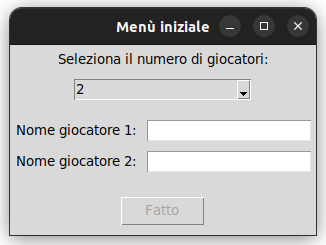

# 🏦 Monopoly Game

## 🎲 Welcome to the Monopoly Game!

### 📌 About the Project
This project aims to recreate the Monopoly board game graphically using Python. It utilizes various libraries for graphical management, primarily Tkinter.

---

## 📜 Rules Overview

### 🎯 Objective
Be the last player remaining in the game after all others have gone bankrupt.

### 🔄 Game Start
- Each player starts with **1500 coins**.

### 🎲 Turn Sequence
1. Roll the dice and move forward by the number of spaces indicated.
2. Perform the action associated with the space you land on:
   - **Unowned Property**: You can purchase it from the bank.
   - **Owned Property**: Pay rent to the owner.
   - **Special Spaces** (Chance, Community Chest, Tax, etc.): Follow the instructions.
   - **Jail**: You go to jail if you land on the jail space or roll doubles three times in a row.
   - **Buildings**: You can construct houses and hotels on properties you own (if you have a monopoly on that color group).
   - **Trading & Negotiation**: Players can trade properties with each other.

### 💸 Bankruptcy
A player is eliminated when they cannot pay their debts.

---

## 🖼️ Screenshots



---

## 🚀 How to Run the Game

Follow these steps to start the game:

1️⃣ Clone the repository:
```sh
 git clone <repository_url>
```

2️⃣ Navigate to the project folder:
```sh
 cd monopoly-game
```

3️⃣ Install dependencies:
```sh
 pip install -r requirements.txt
```

4️⃣ Launch the game:
```sh
 python main.py
```
